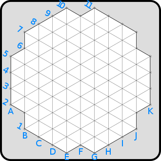
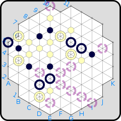
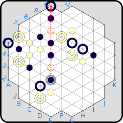

# YINSH
A website to play the board game YINSH with an AI player.

See the current deployment of the project <a href = 'https://antondavidouski.github.io/YINSH/website/index.html' alt = 'here'>. **Work in progress**

<h2> How to play YINSH
<h2>
            Equipment
        </h2>
        

         
        
YINSH is played on a board shaped like a truncated six-pointed star with a triangular grid and 85 spaces (referring to the nodes or intersections), including those along the perimeter. The board is oriented so the lines with the letter labels run between the two players. Each space in the game is available for placement of rings and markers

         
        
         
        
The game pieces are:

        <ul>
            <li>5 black and 5 white rings</li>
            <li>51 reversible 2 sided markers</li>
        </ul>
        
The rings are only available to the players, while the markers are available to both as a common pool.

        

         
        <h2>
            Object
        </h2>
        

         
        
The object of the game is to remove three of one's own rings from the game. Since this is the goal of the game, getting closer to winning necessitates weakening oneself, which considerably complicates strategy as a move which brings one closer to winning the game may end up being a very poor move. 

        

         
        <h2>
            Gameplay
        </h2>
        

         
        <h3>
            Placement
        </h3>
         
            
During the first phase the players, take turns placing one of their rings on the board on any unoccupied space, beginning with white. Once both players each have placed all five of their rings, this phase is over. 

             
        <h3>
            Movement
        </h3>
         
        
The second phase involves forming lines, defined as five adjacent markers in a straight line with a single color. Once a line is formed in one player's color (on either player's turn), that player removes the five markers, and also one of their rings. Once a player has removed three of their rings, they win the game. 

         
        
A turn consists of the following:

        <ol>
            <li>The player chooses one of their rings to move</li>
            <li>The player places a marker, with their own colour face-up, in the middle of that ring in the space it occupies</li>
            <li>The player then moves the ring to another unoccupied space, along a straight line from the originating node. The marker never moves. In general, there are six directions from any node, with exceptions along the perimeter of the game board.</li>
        </ol>
         
        
When moving a ring, the following rules apply:

        <ul>
            <li>The moving ring may not move over other rings.</li>
            <li>The moving ring may pass over any number of markers in a row. If it does so, it must stop on the blank space immediately following the last marker moved over. </li>
            <li>All markers moved over like this are flipped over after moving the ring, reversing their color.</li>
            <li>A moving ring may not end on a space already occupied by a marker.</li>
        </ul>
         
        
It is possible, and not uncommon, to make a move which results in the opposing player having a line of five markers in a row. When more than one line is made in the same turn, the player who just moved resolves their own lines (if any) first, and then the other player resolves their lines (if any) before making his next move. Lines are resolved one at a time, so if a single marker is shared by two lines, only one of those lines may be resolved (but the player chooses which). 

        

         
        <h2>
            Example Move
        </h2>
        

         
        
         
        
On the board above, potential moves for the black ring at E4 are shown with broken rings. Note that K10 is not a possible move, as J9 is the first open space after passing over existing markers; similarly, E1 is not possible. Also, C2 and A4 are blocked by rings. 

         
         
        
         
        
On the board above, black has decided on the move E4→E10 , which results in the placement of a black marker at E4 and the reversal of the colors of the five markers from E5–E9. 

         
         
         
         
         
    

